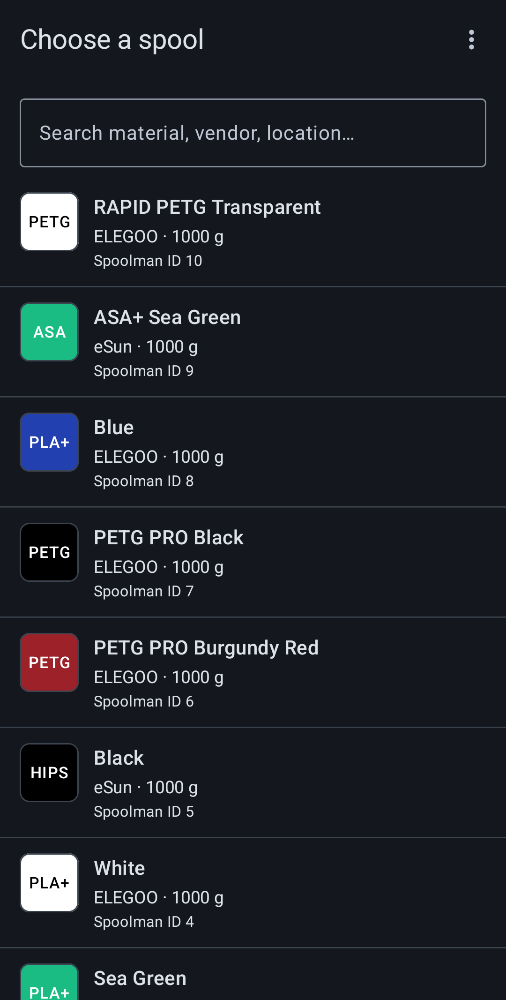
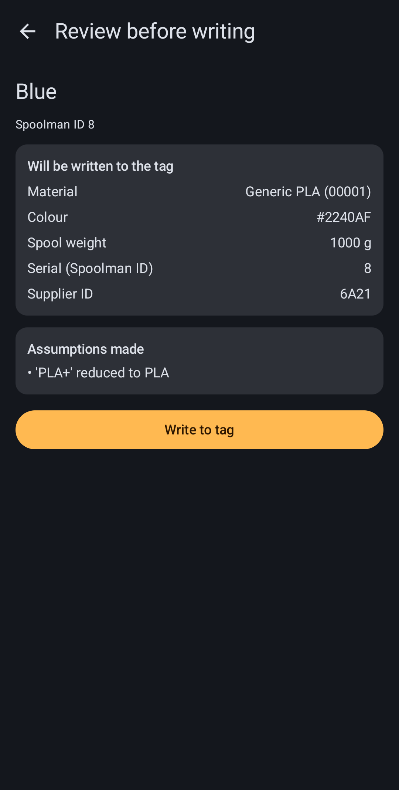
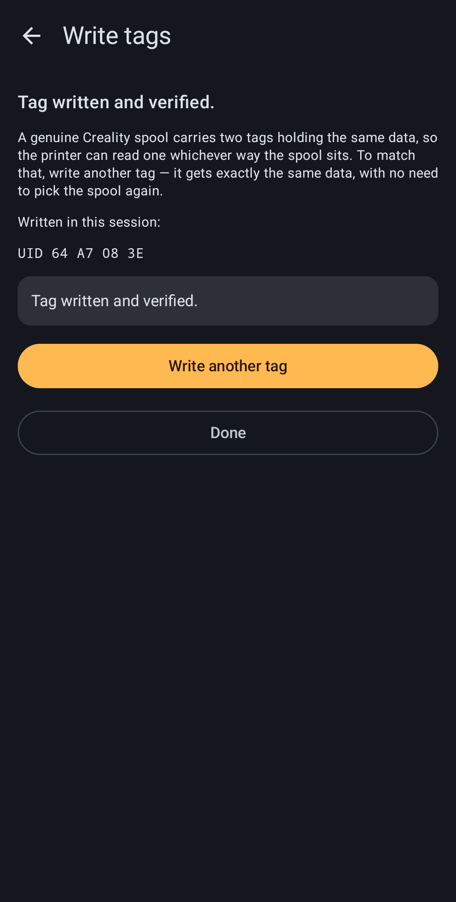
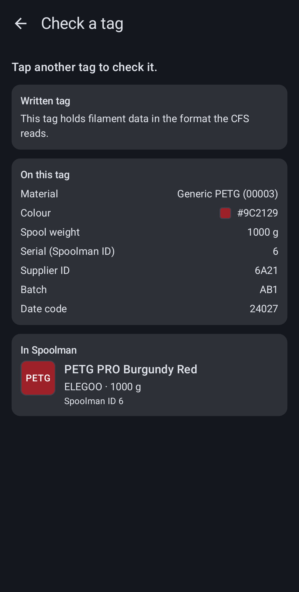

# NFC Spool Writer

An Android app that writes filament data from your own [Spoolman](https://github.com/Donkie/Spoolman)
inventory to NFC tags, in the format the **Creality K2, K2 Plus and K2 Max CFS** reads. Tag a spool
once and the printer recognises it the moment you load it.

  
  
  
  

## What you need

All four, or the app can do nothing useful. Worth checking before you install rather than after:

- **A phone with an NXP NFC chipset.** MIFARE Classic is a proprietary NXP protocol, not an NFC Forum
  standard, so phones with Broadcom or Qualcomm NFC controllers can *detect* these tags but can never
  authenticate to them. There is no software workaround — the app checks at startup and says so
  plainly rather than letting you reach the write screen and fail there.
- **Blank MIFARE Classic 1K tags**, with a 4-byte UID. The 7-byte "double size" UID found on some
  clones cannot work: the key derivation needs exactly 4 bytes.
- **A Spoolman instance** reachable on your network. It is a separate self-hosted project; this app
  ships with no server address and has no server of its own.
- **Android 10 (API 29) or later.**

## How it works

1. Point the app at your Spoolman server, once, in Settings.
2. Pick a spool from your inventory — search by material, vendor or location.
3. Review what will be written. Spoolman's data model does not map 1:1 onto Creality's fixed
   encodings, so the app auto-maps to the nearest valid value and **shows you every approximation it
   had to make** before anything is burned onto a tag.
4. Hold a tag to the phone. The app writes it, reads it back, and compares before reporting success —
   write-and-verify, never write-only.

A tag that already holds data is detected and you are asked before it is overwritten. A genuine
Creality spool carries two tags with identical payloads, so the app can write a second one without
making you select the spool again.

There is also a **read & check** mode: hold any tag to the phone to see what is on it, and whether it
is blank, written by this app, written under an unrelated key scheme, or corrupt. That path never
writes and never installs a key on a tag it inspects.

## Limitations — please read before writing your first tag

Nothing here is hypothetical. Each one is a known property of the problem rather than a bug waiting
to be fixed:

- **A tag can be damaged permanently.** Writing a MIFARE Classic sector means writing its trailer,
  and corrupting the access bits in a trailer can lock that sector for good — no key recovers it.
  The app writes the values it has verified against real tags, but the failure is irreversible when
  it happens, so try a new tag type on one you are willing to lose before committing a batch.
- **A tag pulled away mid-write may be left partially written.** The app retries, tells you when it
  gives up, and such a tag can be rewritten in full — but do not assume an interrupted write left
  the tag untouched.
- **The mapped values are approximations.** Spoolman's data model does not line up 1:1 with
  Creality's fixed encodings — weight buckets, material IDs, batch codes — so the app maps to the
  nearest valid value and fills documented defaults for anything Spoolman does not carry. Every
  approximation is shown on the confirm screen. **Read that screen.** A material mapped to the
  nearest neighbour is a tag your printer will believe.
- **The format is reverse-engineered.** Creality does not document it and there is no compatibility
  guarantee from anyone. A CFS firmware update could change what the reader accepts, and the only
  way that becomes known is someone hitting it.

There is no warranty of any kind — see sections 15 and 16 of the [LICENSE](LICENSE).

## Installing

Not yet published — the first release is still in progress ([TODO.md](TODO.md) §3). When it lands:

- **Google Play** will be the normal route, and its device filter hides phones that cannot run the app.
- **A sideloadable APK** is attached to each [GitHub release](https://github.com/mjeanrichard/nfc-spool-writer/releases)
  for testers outside the Play tracks.

Note that the two are signed differently. The release APK is signed with the *upload* key, not the
Play app-signing key, so a sideloaded install cannot later be upgraded in place by the Play build —
uninstall first if you switch.

## Building

The Gradle root is `src/`, not the repository root. Everything goes through the wrappers in
`scripts/`, which resolve that and a few other local details:

| Task | Command |
|---|---|
| Full verification pass — build, unit tests, lint | `scripts/check.sh` |
| Build the debug APK | `scripts/gradle.sh :app:assembleDebug` |
| Unit tests only | `scripts/gradle.sh :app:testDebugUnitTest` |
| Build, install and launch on a connected phone | `scripts/install.sh` |
| Signed release artifacts | `scripts/release.sh` |

`scripts/check.sh` is what CI runs on every push and pull request, and it includes lint — which the
two Gradle tasks alone do not.

Release signing is optional for local work: with no credentials present the release build is left
unsigned deliberately, so a fresh clone can still run `lintRelease`. To sign locally, copy
`src/keystore.properties.example` to `src/keystore.properties` and fill it in; the keystore itself
belongs outside the repository and is gitignored along with the properties file.

## Documentation

The design intent is written down rather than inferred from the code:

| Document | Covers |
|---|---|
| [REQUIREMENTS.md](REQUIREMENTS.md) | Every functional and non-functional requirement, with stable `HW-`/`REQ-`/`UI-`/`NFR-` identifiers |
| [DESIGN.md](DESIGN.md) | Architecture and settled decisions |
| [TAG_FORMAT_SPEC.md](TAG_FORMAT_SPEC.md) | The tag payload format, key derivation and encryption, with test vectors |
| [TODO.md](TODO.md) | All open work, including the manual hardware validation matrix |
| [AGENTS.md](AGENTS.md) | Working agreements for coding agents in this repo |
| [SECURITY.md](SECURITY.md) | How to report a vulnerability, and what is deliberately out of scope |

The CFS tag format is proprietary and undocumented by Creality; it was reverse-engineered by the
community. [TAG_FORMAT_SPEC.md](TAG_FORMAT_SPEC.md) reflects this project's own understanding
validated against real hardware, and where it disagrees with other implementations, it wins.
Reference projects are credited in [REQUIREMENTS.md](REQUIREMENTS.md) §2.

## Privacy

The app collects nothing. No accounts, no analytics, no crash reporting, no advertising, no
third-party SDKs of any kind.

It stores exactly one thing — the Spoolman address you type into Settings — and talks to no server
other than that one, read-only. It requests two permissions: `NFC`, and `INTERNET` to reach the
address you supply. Full text in the [privacy policy](https://mjeanrichard.github.io/nfc-spool-writer/privacy-policy).

## Security

Please report vulnerabilities privately — see [SECURITY.md](SECURITY.md), which also lists the things
that look like findings but are deliberate (the tag encryption keys are fixed constants of the
Creality format, not secrets, and cleartext HTTP is permitted on purpose).

## Licence

Copyright © 2026 Meinrad Jean-Richard.

Licensed under the **GNU General Public License v3.0** — see [LICENSE](LICENSE).

You may use, study, share and modify it. If you distribute a modified version, you must release your
source under the same terms. Commercial use is not forbidden; taking the code closed is.

## Not affiliated

This project is not affiliated with, endorsed by, or sponsored by Creality. Spoolman is a separate
open-source project, also unaffiliated. All product names are the property of their respective owners.

The app writes filament data for spools you already own.
